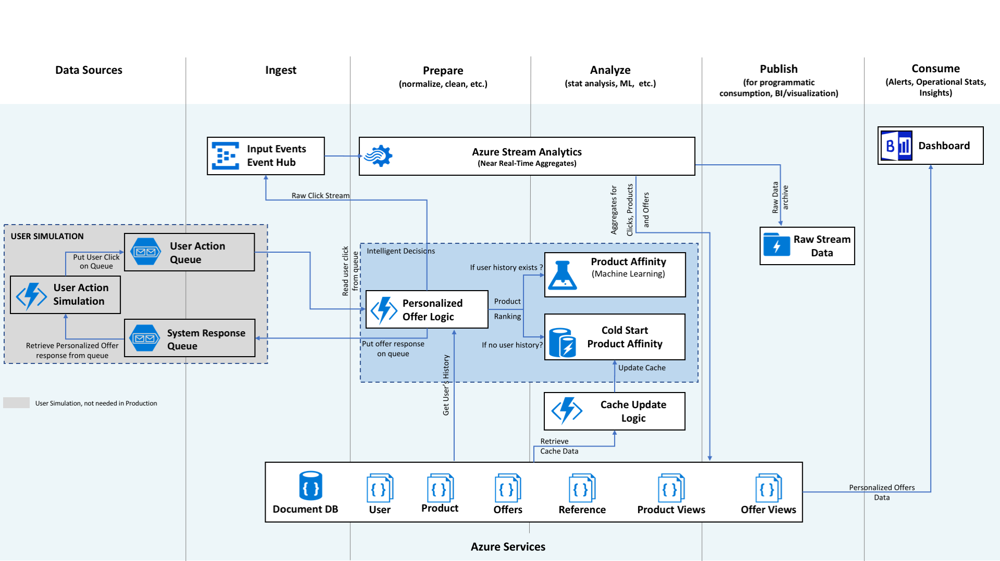

# [Personalized Offers](https://gallery.cortanaintelligence.com/solution/52ae278b2397486d85111307dfe680e4)

This document is focusing on the post deployment instructions for the manual deployment guide. The source code of the solution as well as manual deployment instructions can be found [here](README.md).

### Quick Links
- [Solution Architecture](#architecture) - Overview of the architecture
- [Monitor Progress](#monitor-progress) - See how you can monitor the resources that have been deployed to your subscription
- [Visualization Steps](#visualization) - Instructions to connect up a Power BI dashboard to your deployment that visualized the results
- [Customization](#customization) - Guidance on how to customize the offer logic and retrain the model
- [Scaling](#scaling) - Guidance on how to think about scaling this solution according to your needs
- [Stopping the Solution](#stopping) - How to stop or delete the solution

## Architecture
The architecture diagram shows various Azure services that are deployed by [Personalized Offers Solution](https://github.com/Azure/cortana-intelligence-personalized-offers) using [Azure AI platform](https://azure.microsoft.com/overview/ai-platform/) with [Azure services](https://azure.microsoft.com), and how they are connected to each other in the end-to-end solution.

1. User activity on the website is simulated with an **Azure Function** and a pair of **Azure Storage Queues**, these would not be part of a production solution.

2. Personalized Offer Functionality is implemented as an **Azure Function**. This is the key function that ties everything together to produce an offer and record activity. Data is read in from **Azure Redis Cache** and **Azure Cosmos DB**, product popularity probability is returned by **Azure Machine Learning** (if no history for the user exists then cold start values for product popularity are read in from **Azure Redis Cache**). 

3. Raw user activity data (Product and Offer Clicks), Offers made to users, and performance data (for **Azure Functions** and **Azure Machine Learning**) are sent to **Azure Event Hub**.

4. The offer is returned to the User. In our simulation this is done by writing to an **Azure Storage Queue** and picked up by an **Azure Function** in order to produce the next user action.

5. **Azure Stream Analytics** analyzes the data to provide near real-time analytics on the input stream from the **Azure Event Hub**. The aggregated data is sent to **Azure Cosmos DB** and directly published to **PowerBI** for visualization.  The raw data is sent to **Azure Data Lake Storage**.

All the resources listed above besides Power BI are already deployed in your subscription. The following instructions will guide you on how to start the solution, monitor your solution and create visualizations in Power BI.

## Monitor progress
Your resource group page in the [Azure Portal](https://ms.portal.azure.com) will provide you with some information on how the each of the services in this solution is running. You can use **Metrics** menu on the left side of the resource group panel for more information.

#### Azure App Service ####
For more information on how to monitor Azure App Service, take a look at the documentation [here](https://docs.microsoft.com/en-us/azure/app-service-web/web-sites-monitor).

#### Azure Cosmos DB ####
For more information on how to monitor Cosmos DB, take a look at the documentation [here](https://docs.microsoft.com/en-us/azure/cosmos-db/monitor-accounts).

#### Azure Functions ####
For more information on how to monitor Azure Functions, take a look at the documentation [here](https://docs.microsoft.com/en-us/azure/azure-functions/functions-monitoring).

#### Azure Machine Learning Web Service
You can view the machine learning experiment by navigating to your Machine Learning Workspace. The machine learning model is deployed as an Azure Web Service. For more information on monitoring the web service endpoint, take a look at the documentation [here](https://docs.microsoft.com/en-us/azure/machine-learning/machine-learning-manage-new-webservice).

#### Azure Redis Cache ####
For more information on how to monitor Azure Redis Cache, take a look at the documentation [here](https://docs.microsoft.com/en-us/azure/redis-cache/cache-how-to-monitor).

## Visualization
Power BI dashboard can be used to visualize the real-time personalized offer data as it is being generated. The following instructions will guide you to build a dashboard to visualize data from database and from real-time data stream.

### Visualize Personalized Offer Data from Azure Cosmos DB

The goal of this part is to get a visual overview of how the Personalized Offers for Retail Solution is running. Power BI can directly connect to an Azure Cosmos DB as its data source, where the solution results are stored.

> Note:  1) In this step, the prerequisite is to download and install the free software [Power BI desktop](https://powerbi.microsoft.com/desktop). 2) We recommend you start this process 2-3 hours after you deploy the solution so that you have more data points to visualize.

1. Get the database credentials.
    You can find your Cosmos DB URI and Primary Key from your Cosmos DB resource page in the [Azure Portal](https://ms.portal.azure.com). Go to the Resource group page for your solution and select your Cosmos DB service. On the left side of the page there is a **Keys** section where this information can be found.
    
2. Update the data source of the Power BI file	
    1. Make sure you have installed the latest version of [Power BI desktop](https://powerbi.microsoft.com/desktop).
    2. Download either ***PersonalizedOffersSolutionLandscape.pbix*** or ***PersonalizedOffersSolutionPortrait.pbix*** file from the folder [***PowerBI***](../PowerBI/) in this GitHub repository and open it. The portrait one has all of the information in one tab and the landscape one uses two tabs.
    > Note: If you see an error massage while opening the file, please make sure you have installed the latest version of Power BI Desktop.
    3. Once you open the file with PowerBI, click **Edit Queries** button on the **Home** menu at the top.
    4. In the pop out window (ignore warnings shown at the center for now), you will see 9 Queries on the left hand side and on the right side you will see Query Settings. Follow the steps below for each of **offerCollection**, **products**, **userProductViews**, **referenceCollection**, **users**, **userOfferViews**, and **OfferProducts**:
        1. Select the query from the left hand side
        2. From the **Query Settings** on the right hand side, click the **gear** icon of **Source** under the **Applied Steps** section
        3. Enter the URI that you got from Cosmos DB into the **URL** field and click **OK**
        4. A prompt should ask you for the **Account Key**. Enter the Primary Key you got from Cosmos DB there. (You should only have to do this for the first query)
        5. Repeat these steps for the other queries listed above
    5. For the **userProductViews** query, there are some additional steps to take from the **Applied Steps** section:
        1. Click on the 6th step, **Expanded productviews**, gear icon
        2. From the popup window, click the **Load More** link near the bottom
        3. Verify that all products (1-25) are there in the list and select them all by using the **Select All Columns** checkbox at the top
        4. Click **OK**
        5. Click on the next step, **Renamed Columns1**, and make sure the product number columns at the top are all correct and of type: 1, 2, 3, ... 25 for the columns representing the products. If prompted to okay the change, go ahead and click **Insert**.
    6. Click **Close & Apply Changes** button on the top of the window
    7. Now the dashboard is updated to connect to your database. You can click **'Refresh'** button on the top to get the latest visualization.

## **Customization**
You can reuse the [source code](scr/) in the [Manual Deployment Guide](README.md) to customize and rebuild the solution for your data and business needs.

See the [Offer Logic Documentation](OfferLogic.md) to see more information of how the offers are generated in this solution and the [Retraining Documentation](RetrainingModel.md) to show how to retrain your model.

For more help, you can [connect with one of our partners](https://azure.microsoft.com/en-us/partners/) for information on how to tailor Azure AI to your needs.

## **Scaling**
Many of the services used in this solution were selected because they scale up/out, are available in many regions, and have multiple ways they can be further tuned. The following changes and details are not needed to run this solution, but provide a starting point for learning how to scale the solution to handle larger volumes or more global distribution. 

This solution has the capacity to run at a much higher rate than currently configured and is slowed down with line 62 of the run.csx function in the PersonalizedOfferFunction.

		Thread.Sleep(2000);
		

This forces each function instance to take a minimum of 2 seconds and overall we end up running at 1 simulation/second with our 2 function instances.  Removing this line will significantly speed up the solution.  There are whole series of issues to consider when scaling up the solution:

1. **AzureML**
	* Our solution makes a request for every request made by a user to AzureML.
	* As the number of requests scale up the endpoint needs to be able to handle the number of requests. We currently have 1 endpoint and allow for 200 concurrent requests.
	* If the volume is going to be very high, maybe the results should be cached of the user affinity to products with a timeout period. Only make the call to AzureML if the cache has timed out. This will reduce the volume of calls to AzureML.
	* Adding more endpoints to handle additional load. [Documentation Link](https://docs.microsoft.com/en-us/azure/machine-learning/machine-learning-scaling-webservice)
	
2. **Azure Functions and Azure App Plan**
	* The App Plan can be scaled up by increasing type of machine being used or scaled out by increasing the number of instances.
	* The Azure Functions can be scaled out as well by increasing the number of instances of a function run simultaneously in the hosts.json.
	* Making sure data sent to Event Hub is sent partitioned by a partition id (this same partition information will be used by Stream Analytics and Cosmos DB)
	* Azure Functions scaling via [Service Plan](https://docs.microsoft.com/en-us/azure/azure-functions/functions-scale) and by editing the [host.json](https://github.com/Azure/azure-webjobs-sdk-script/wiki/host.json) file
	
3. **Azure Event Hub**
	* Currently set for 16 partitions and a throughput of 20. If the partitions are increased then make sure you can handle this in Cosmos DB and Stream Analytics.
	* Event Hub Partitioning - [Documentation Link 1](https://docs.microsoft.com/en-us/azure/event-hubs/event-hubs-what-is-event-hubs) and [Documentation Link 2](https://docs.microsoft.com/en-us/azure/event-hubs/event-hubs-programming-guide#partition-key)
	
4. **Azure Stream Analytics**
	* Checking to see that stream jobs that go to partitioned Cosmos DB collection make use of queries that are partitioned. The input partitions and output partitions should match up.
	* Check to see whether using [sliding, hopping or tumbling windows](https://msdn.microsoft.com/en-us/library/azure/dn835019.aspx) is appropriate for your stream jobs. Each has a different effect on your stream job and the streaming throughput requirements for your job to run smoothly.
	* Check to see the SU% figure to see that the utilization numbers aren't too high, otherwise you may start seeing a lag in data being processed by your stream job.
	* [Scaling by partitioning queries in Stream Analytics](https://docs.microsoft.com/en-us/azure/stream-analytics/stream-analytics-scale-jobs)
	* [Partitioning output from Stream Analytics](https://docs.microsoft.com/en-us/azure/stream-analytics/stream-analytics-documentdb-output)
	
5. **Azure Cosmos DB**
	* Partitioned collections require at least 10GB, but at 10GB only 1 physical device exists so all partitions are on the same physical device. This does not offer the best througput possible.
	* A 250GB capacity will allow for 25 10GB physical partitions. Each capable of holding multiple logical partitions that are distributed to give the best performance.
	* Increasing a partition size later requires moving your data out, recreating your collection and migrating your data to the new partition.
	* [Partitioning in Cosmos DB](https://docs.microsoft.com/en-us/azure/cosmos-db/partition-data)

For some additional ideas on scaling see the links below to learn more:

* **Azure Traffic Manager** - Used to route a user request to the service endpoint nearest to the user. [Documentation Link](https://docs.microsoft.com/en-us/azure/traffic-manager/traffic-manager-overview)
* **Azure Application Gateway** - Load Balancing your Application. [Documentation Link](https://docs.microsoft.com/en-us/azure/application-gateway/application-gateway-introduction)

## **Stopping the Solution**

The easiest way to pause the solution is to stop generating events:

1. Go to your **resource group** created for this solution
2. Go to the **App Service** associated with this resource
3. Click on the **PersonalizedOfferFunction**
4. Click on the **Manage** link below the Function name on the left
5. Set the *Function State* at the top to **Disabled**
6. This will stop generating data which will reduce the consumption of resources in the subscription

To entirely remove the solution

1. Go to your **resource group** created for this solution
2. Click **Delete** at the top of the screen.
