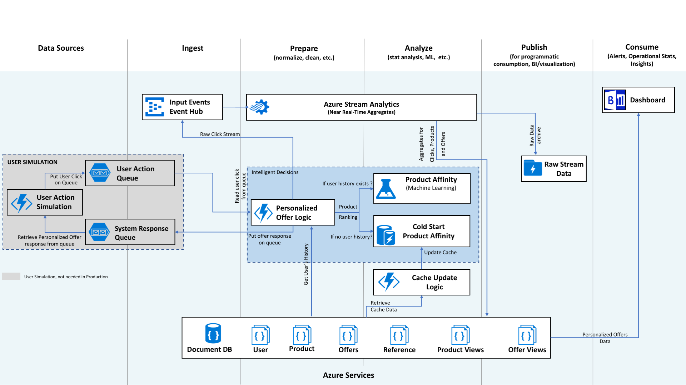

# Personalized Offers - An Azure AI Solution How-to Guide

In today’s highly competitive and connected environment, modern businesses can no longer survive with generic, static online content. Furthermore, marketing strategies using traditional tools are often expensive, hard to implement, and do not produce the desired return on investment. These systems often fail to take full advantage of the data collected to create a more personalized experience for the user.

Surfacing offers that are customized for the user has become essential to build customer loyalty and remain profitable. On a retail website, customers desire intelligent systems which provide offers and content based on their unique interests and preferences. Digital marketing teams can build this intelligence using the data generated from all types of user interactions. By analyzing massive amounts of data, marketers have the unique opportunity to deliver highly relevant and personalized offers to each user. However, building a reliable and scalable big data infrastructure, and developing sophisticated machine learning models that personalize to each user is not trivial. 

This solution combines several Azure services to provide powerful advantages in making personalized offers to the customer. Event Hubs collects real-time consumption data. Stream Analytics aggregates the streaming data and updates the data used in making personalized offers to the customer. Azure Cosmos DB stores the customer, product and offer information. Azure Storage is used to manage the queues that simulate user interaction. Azure Functions are used as a coordinator for the user simulation and as the central portion of the solution for generating personalized offers. Azure Machine Learning implements and executes the product recommendations and when no user history is available Azure Redis Cache is used to provide pre-computed product recommendations for the customer.

## Solution Architecture

## Technical details and workflow
1. User activity on the website is simulated with an **Azure Function** and a pair of **Azure Storage Queues**.

2. Personalized Offer Functionality is implemented as an **Azure Function**. This is the key function that ties everything together to produce an offer and record activity. Data is read in from **Azure Redis Cache** and **Azure Cosmos DB**, product affinity scores are computed from **Azure Machine Learning** (if no history for the user exists then pre-computed affinities are read in from **Azure Redis Cache**). 

3. Raw user activity data (Product and Offer Clicks), Offers made to users, and performance data (for **Azure Functions** and **Azure Machine Learning**) are sent to **Azure Event Hub**.

4. The offer is returned to the User. In our simulation this is done by writing to an **Azure Storage Queue** and picked up by an **Azure Function** in order to produce the next user action.

5. **Azure Stream Analytics** analyzes the data to provide near real-time analytics on the input stream from the **Azure Event Hub**. The aggregated data is sent to **Azure Cosmos DB**.  The raw data is sent to **Azure Data Lake Storage**. 

## Solution Dashboard
PowerBI visualizes the activity of the system with the data from Cosmos DB. The snapshot below shows an example PowerBI dashboard that gives insights into the offers being shown to customers and predicted customer affinity to those offers.

## Getting Started

This solution package contains materials to help both technical and business audiences understand our Personalized Offers solution for Retail built on [Azure Platform](https://partner.microsoft.com/en-us/solutions/microsoft-azure-platform).

## Business Audiences

In this repository you will find a folder labeled [*Solution Overview for Business Audiences*](Solution%20Overview%20for%20Business%20Audiences/) which contains a  presentation covering this solution and benefits of using Azure services and Azure AI.

For more information on how to tailor Azure services to your needs [connect with one of our partners](https://azure.microsoft.com/en-us/partners/).

## Technical Audiences

See the [*Manual Deployment Guide*](Manual%20Deployment%20Guide/README.md) folder for a full set of instructions on how to put together and deploy a Personalized Offers solution using Azure services. For technical problems or questions about deploying this solution, please post in the issues tab of the repository.

## Related Resources
A playbook for approaching personalization problems, which can be considered to include use cases such as that discussed within this solution, is published [here](https://github.com/Azure/cortana-intellligence-personalization-data-science-playbook).

# Contributing

This project has adopted the [Microsoft Open Source Code of Conduct](https://opensource.microsoft.com/codeofconduct/). For more information see the [Code of Conduct FAQ](https://opensource.microsoft.com/codeofconduct/faq/) or contact [opencode@microsoft.com](mailto:opencode@microsoft.com) with any additional questions or comments.
